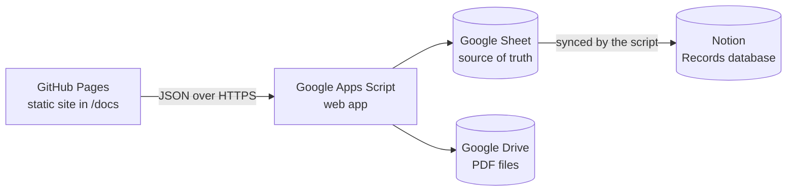

# Session Records Management System

Tutor session records with user accounts, access codes, PDF notes upload, and
Notion sync — hosted **100% free on GitHub Pages**, with no server to run.

**▶ Live app: https://yu314-coder.github.io/session-records-app/**

*Deployed and working. The setup steps below are kept for reference / redeploying
from scratch — they have already been completed for the live instance.*



Every record is written to the Google Sheet first, then pushed on to Notion
(including the uploaded PDF). If Notion is unreachable, the record is kept in
the Sheet and retried later — nothing is lost.

## Setup

### 1. Google Sheet + Apps Script (the backend)

1. Create a new [Google Sheet](https://sheets.new).
2. Open **Extensions → Apps Script** and replace the default code with the
   contents of [`apps-script/Code.gs`](apps-script/Code.gs).
3. In the editor, run the `setup` function once and authorize it. This creates
   the tabs (`Users`, `AccessCodes`, `Records`, `RecordsArchive`, `Counts`,
   `Sessions`) and a starter access code `CHANGE-ME` — edit the
   **AccessCodes** tab and set your own code(s).
4. **Deploy → New deployment → Web app**:
   - *Execute as*: **Me**
   - *Who has access*: **Anyone**

   Copy the `.../exec` URL.

> Updating the backend later: **Deploy → Manage deployments → ✏️ Edit →
> Version: New deployment** — this keeps the same URL.

### 2. Notion sync (optional)

In the Apps Script editor, open **Project Settings → Script Properties** and add:

| Property | Value |
|---|---|
| `NOTION_API_KEY` | your Notion integration token |
| `NOTION_RECORDS_DB_ID` | the id of your Records database |

The Notion database must have the same properties as the original app:
`ID` (number), `DateTime` (date), `Department` (select), `UserID` (rich text),
`SyllabusText` (rich text), `NotionFile` (files), `OriginalFileName`
(rich text), `FileSize` (number). Share the database with your integration.

Optionally add a time-driven trigger (**Triggers → Add trigger →
`syncPendingToNotion` → hourly**) so failed syncs retry automatically.

Without these properties the app runs on Sheets + Drive only.

### 3. GitHub Pages (the frontend)

1. Paste the web app URL from step 1 into [`docs/config.js`](docs/config.js):

   ```js
   window.SRA_CONFIG = {
     API_URL: 'https://script.google.com/macros/s/XXXXXXXX/exec'
   };
   ```

2. Commit and push, then enable Pages: repo **Settings → Pages →
   Deploy from a branch → `main` / `docs`**.
3. Open `https://<your-username>.github.io/session-records-app/` — done.

## How it works

- **Auth** — passwords are salted and hashed (iterated SHA-256) in the
  `Users` tab; an improvement over the old server, which stored them in plain
  text. Login returns a random token (24h lifetime, `Sessions` tab) that the
  browser keeps in `localStorage`.
- **Access codes** — checked against the `AccessCodes` tab after login, same
  gate as before.
- **Records** — appended to the `Records` tab, then mirrored to Notion by the
  script (the Notion page id is stored back in the row). "Clear All Records"
  moves rows to `RecordsArchive`, archives the synced Notion pages, resets
  `Counts`, and leaves an audit row — matching the original behavior.
- **Files** — PDFs (max 20MB) are stored in a Drive folder
  (*Session Records Files*, link-viewable) **and** uploaded into the Notion
  record. View/download buttons link straight to Drive, so files never expire
  the way Notion's temporary URLs did.
- **CORS** — the site sends "simple" `text/plain` POSTs, which Apps Script
  web apps accept cross-origin without a preflight.

## Repository layout

| Path | Purpose |
|---|---|
| `docs/` | Static frontend served by GitHub Pages |
| `apps-script/Code.gs` | Backend — paste into the Sheet's Apps Script |
| `server.js`, `public/`, `render.yaml` | Legacy Node/Express + Notion version (needs a server, e.g. Render) |

## License

MIT
